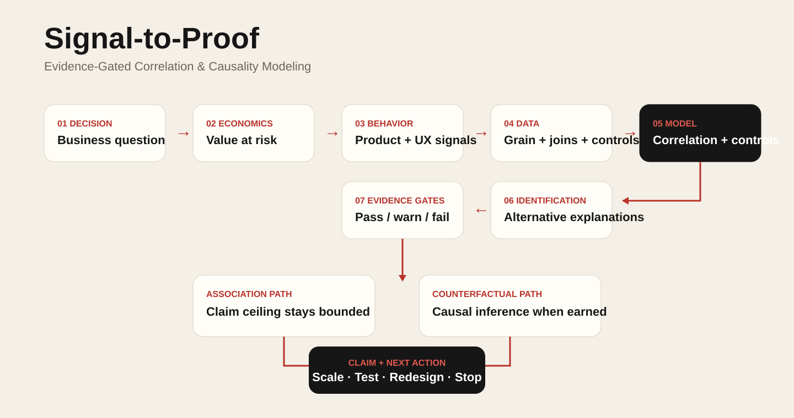
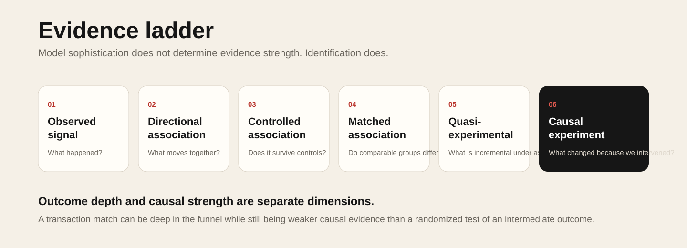

# Signal-to-Proof

### Evidence-Gated Correlation & Causality Modeling

**A public technical demonstrator by Gerry Sun / GRDigital**

Signal-to-Proof is a **marketing measurement decision system** that determines when behavioral signals support correlation, when stronger causal inference is defensible, and what experiment or evidence is required before a business scales an intervention.

It connects **data readiness, statistical modeling, identification, counterfactual design, evidence gates, and business action** in one claim-safe system.

> **Correlation tells us what moves together. Causal inference asks what changed because we intervened. Signal-to-Proof determines which question the available evidence can actually answer.**

**Live demonstrator:** https://gerardsun.github.io/gerrysun-grdigital-signal-to-proof/  
**GRDigital:** https://www.geraldrobert.com/

## Why this exists

Modern marketing and growth systems create more observable signals than trustworthy conclusions. Exposure, engagement, product behavior, leads, transactions, and revenue can all appear in the same dashboard while leaving the central question unresolved: **did the intervention change the outcome, or did it simply coincide with demand that was already forming?**

Signal-to-Proof treats marketing measurement as an engineering problem rather than a reporting problem. The work is not finished when a model produces a coefficient. The system must also determine what the data and design have earned the right to say, what they have not earned the right to say, and what evidence should be acquired next.

The public demonstrator shows how to:

- define the business decision before selecting the model;
- make economic stakes visible alongside statistical evidence;
- validate grain, keys, coverage, controls, and exposure variation;
- separate raw correlation from controlled association;
- detect important selection and identification risks;
- require a counterfactual before causal language is allowed;
- check minimum detectable effect before a test is treated as decision-grade;
- convert model output into an evidence grade, an allowed claim, a blocked claim, and a next action;
- connect the analytical result back to product, UX, GTM, and investment decisions.

## The operating idea

A more sophisticated model is not automatically stronger evidence. Evidence strength depends on identification: whether the data and design can separate the intervention from plausible alternative explanations.

```text
BUSINESS DECISION
       |
       v
DECISION ECONOMICS
       |
       v
BEHAVIOR + PRODUCT SIGNALS
       |
       v
DATA / GRAIN / JOIN READINESS
       |
       v
CORRELATION + CONTROLLED MODELING
       |
       v
IDENTIFICATION CHECKS
       |
       v
EVIDENCE GATES
       |
       +--------------------+
       |                    |
       v                    v
ASSOCIATION          COUNTERFACTUAL DESIGN
                            |
                            v
                     CAUSAL INFERENCE
                            |
                            v
                      CLAIM CEILING
                            |
                            v
                      BUSINESS ACTION
```



## What the system is deciding

Signal-to-Proof is built around a recurring set of measurement questions:

1. **Is there a relationship?**  
   Measure association, direction, strength, timing, and pattern.

2. **Does the relationship survive alternative explanations?**  
   Introduce controls, lags, fixed effects, segmentation, robustness checks, and selection diagnostics.

3. **Is the relationship identifiable?**  
   Determine whether the observed variation can actually separate the intervention from demand, timing, targeting, or other confounds.

4. **Does a defensible counterfactual exist?**  
   Distinguish observational and matched evidence from quasi-experimental or randomized designs.

5. **What claim has the evidence earned?**  
   Produce an evidence grade, allowed claim, blocked claim, and next evidence step.

6. **What should the business do next?**  
   Scale, test, redesign, maintain, or stop based on evidence strength and decision economics.

## Try it

Python 3.11+ is recommended.

```bash
python -m venv .venv
source .venv/bin/activate
pip install -e .[dev]
python run_demo.py --scenario observational
python run_demo.py --scenario randomized
pytest -q
```

The two included scenarios are intentionally different:

**Observational:** a strong raw relationship exists, but selection risk and the absence of a counterfactual cap the claim at controlled association.

**Randomized:** treatment assignment and a valid pre/post design support a causal estimate within the tested scope, provided the power gate passes.

All demonstration data are synthetic and contain no confidential or client data.

## What to inspect first

| If you have... | Start here |
|---|---|
| 1 minute | [Live demonstrator](https://gerardsun.github.io/gerrysun-grdigital-signal-to-proof/) |
| 2 minutes | [`EVALUATION_GUIDE.md`](EVALUATION_GUIDE.md) |
| 5 minutes | [`ARCHITECTURE.md`](ARCHITECTURE.md) + [`EVIDENCE_LADDER.md`](EVIDENCE_LADDER.md) |
| 10 minutes | [`METHODOLOGY.md`](METHODOLOGY.md) + [`DECISION_SYSTEM.md`](DECISION_SYSTEM.md) |
| 20 minutes | [`src/signal_to_proof/`](src/signal_to_proof/) + [`tests/`](tests/) |
| Technical review | [`DEMO_WALKTHROUGH.md`](DEMO_WALKTHROUGH.md) + `pytest -q` |
| IP / public boundary | [`IP_BOUNDARY.md`](IP_BOUNDARY.md) |

## Evidence ladder

1. Observed signal
2. Directional association
3. Controlled association
4. Matched association
5. Quasi-experimental estimate
6. Causal experiment



Outcome depth and causal strength are deliberately separated. A deeply matched business outcome can be more operationally useful than an upper-funnel event while still being weaker causal evidence than a well-designed experiment.

## System-level lens

Correlation and causality modeling remain the technical spine. The surrounding system exists to make the modeling decision-useful.

- **Strategy:** What decision is leadership making?
- **Economics:** What is the value at risk, and is stronger evidence worth acquiring?
- **UX:** Which observable behaviors represent progress, friction, confidence, or abandonment?
- **Product:** Which events, identities, and interfaces must be instrumented?
- **Data:** What grain, keys, coverage, lineage, and controls are actually available?
- **Statistics:** What moves together, and does the relationship survive controls?
- **ML:** What can be predicted or segmented without being mistaken for causal effect?
- **Causal inference:** What changed because of the intervention under a defensible counterfactual?
- **GTM:** How should evidence change audience, content, channel, offer, rollout, or adoption strategy?
- **Executive decision:** Scale, test, redesign, maintain, or stop.

## Why the claim gate matters

The core design principle is simple: **model sophistication does not determine evidence strength. Identification does.**

The system can discover a strong correlation and still block a causal claim. It can connect an exposure to a deep downstream outcome and still distinguish that match from incrementality. It can recommend a more rigorous test when the cost of uncertainty justifies one, or recommend continued observational monitoring when a causal test would cost more than the decision warrants.

The goal is not to make every analysis causal. The goal is to make the evidence boundary visible enough that the business knows what it can responsibly act on.

## Public boundary

This repository is a deliberately bounded reference implementation. It demonstrates selected interfaces, evidence controls, statistical methods, validation patterns, tests, and synthetic examples. Production connectors, private implementation logic, client-specific schemas, proprietary scoring systems, internal operating artifacts, and other non-public methods are not included.

See [`IP_BOUNDARY.md`](IP_BOUNDARY.md) and [`LICENSE.md`](LICENSE.md).

## About Gerry Sun / GRDigital

Gerry Sun is the founder of GRDigital, an end-to-end practice spanning business strategy, economics, product and platform systems, UX and service design, behavioral analytics, go-to-market, operating models, and AI/ML ecosystems. Signal-to-Proof reflects that cross-disciplinary approach: start with the business decision, build the measurement system around how people and products actually behave, then earn the right to make stronger claims through better evidence.

Website: https://www.geraldrobert.com/

## Repository map

```text
.
├── README.md
├── ABOUT.md
├── ARCHITECTURE.md
├── METHODOLOGY.md
├── EVIDENCE_LADDER.md
├── DECISION_SYSTEM.md
├── DEMO_WALKTHROUGH.md
├── EVALUATION_GUIDE.md
├── REFERENCES.md
├── IP_BOUNDARY.md
├── LICENSE.md
├── llms.txt
├── run_demo.py
├── pyproject.toml
├── src/signal_to_proof/
├── demo/
├── tests/
├── schemas/
├── scripts/
└── docs/
```
